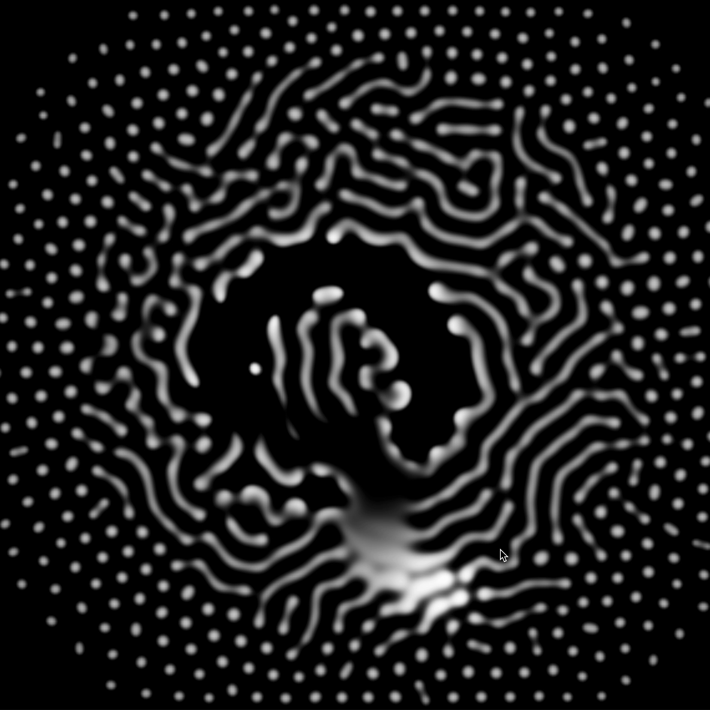

# NFT/Reaction Diffusion
### Source code for interactive NFT mints on [hicetnunc](https://www.hicetnunc.xyz/objkt/37551)



### Getting Started
Check [hicetnuncs Interactive OBJKTs Guide](https://github.com/hicetnunc2000/hicetnunc/wiki/Interactive-OBJKTs).

This piece uses [parcel](https://parceljs.org/) to bundle all the assets together.

- `npm run dev` will spin up a local, hot-reloading dev server
- `npm run build` will compile all the assets to a `dist/` directory
- For minting, some adjustments to `dist/index.html` were necessary: 
  - Imports needed to be changed to relative paths starting with `./`
  - `cover.$HASH.ng` needed to be renamed back to `cover.png`


### Stumbling Blocks
- `npm run build` prefixes all the included files with `/`.  To get the cover image working, I needed to rename it back to `cover.png` and include it without a leading slash:
```
<meta property="og:image" content="cover.png">
```
- The piece does not work on iOS/Safari currently (not tested on Android). Could
  be due to lack of [WEBGL_color_buffer_float API](https://caniuse.com/?search=webgl%20float). I haven't evaluated this any
  further yet. A quick but unsatisfactory workaround could be to test for iOS and just display the `cover.png`.


### :warning: Disclaimer
This repository is open sourced for learning purposes. Its intention is to help
others learn how to create interactive NFTs on [hicetnunc](https://hicetnunc.xyz). 

Please do not copymint my work, consider hicetnuncs [code of ethics](https://www.hicetnunc.xyz/objkt/8335) and give credit if you should use my code.

